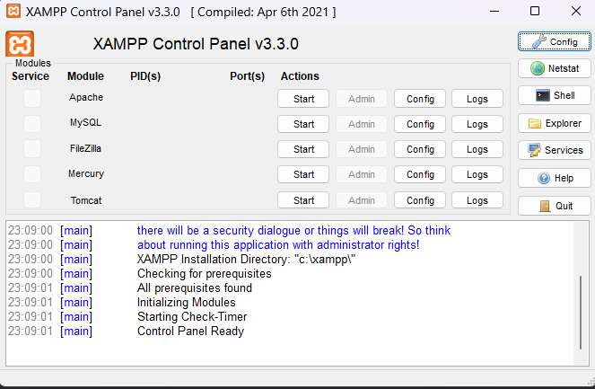
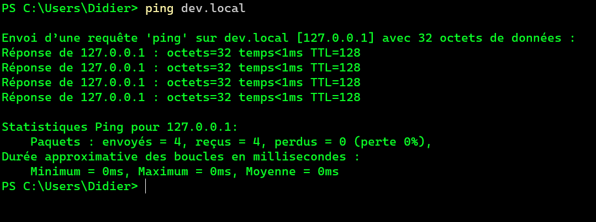

[Menu](../menu.md)

8 - Installation Apache et configuration  

Installation:  
Téléchargement de Xampp depuis https://www.apachefriends.org/  
Exécution de l'installeur téléchargé



  
Configuration/virtualhosts:  
Le dossier racine par défaut (root) d'Apache pour la publication de ressources web est c:\xampp\htdocs.  
La mise en place de virtualhosts permet de spécifier des localisations et noms DNS pour chaque site hébergés :
Enregistrement DNS local  
Pour ajouter le nom dev.local dans le fichier hosts, il faut insérer la ligne suivante dans le fichier c:\windows\system32\driver\etc\hosts  
`127.0.0.1 dev.local` 

En testant la résolution DNS, on obtient:  
  
Virtualhosts  
Les virtualhosts sont configurés dans c:\xampp\apache\conf\extra\httpd-vhost.conf :
Ajout d'un vhost pour préserver l'accès normal à la racine de Xampp :
```
<VirtualHost *:80>
DocumentRoot "C:/xampp/htdocs/"
ServerName 127.0.0.1  
</VirtualHost>  
```  
Ajout d'un vhost par name pour dev.local :
```
<VirtualHost *:80>
    DocumentRoot "C:\Users\Didier\Documents\Git\nfa085\web"
    ServerName dev.local
    ErrorLog "logs/dev.local-error.log"
    CustomLog "logs/dev.local-access.log" common
    <Directory "C:\Users\Didier\Documents\Git\nfa085\web">
        Require all granted    
    </Directory>
</VirtualHost

```  
Création du fichier index.html à la racine du dossier (utilisé comme DirectoryIndex).
```html
<!doctype html>
<html lang="fr">
<head>
    <meta charset="UTF-8">
    <meta name="viewport" content="width=device-width, user-scalable=no, initial-scale=1.0, maximum-scale=1.0, minimum-scale=1.0">
    <meta http-equiv="X-UA-Compatible" content="ie=edge">
    <title>Web local</title>
</head>
<body>
    <h1>TDs web</h1>
</body>
</html>
```  
Redémarrage de Apache et test à l'adresse http://dev.local :


