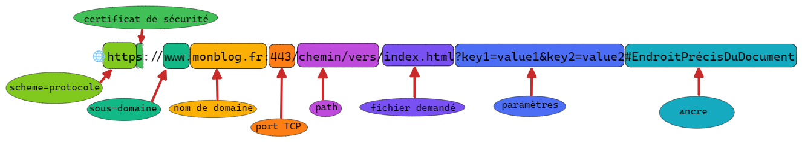

[Menu](../menu.md)

5 - URL  

  
Créé avec Excalidraw (Obsidian)

L'URL (Uniform Resource Locator) désigne  l’endroit, sur le réseau, où est située la ressource pointée par l’URL.  
Elle est composée de plusieurs parties:
- protocole: en anglais scheme (schéma), il désigne le protocole utilisé pour
  la communication client/serveur. Il en existent plus de 250 (http, https, mailto, data, skype, chrome, bitcoin...)
- les deux points (:) séparent le protocole du reste de l'URL.
- les deux slashes (//) indiquent qu'un nom de domaine va suivre. (pas le cas pour mailto: par exemple)
- le nom de domaine indique le serveur web sollicité. Ce peut aussi être une adresse IP mais un nom de domaine peut
  très bien changer d'adresse IP et donc le lien devient obsolète.
- les deuxièmes deux point (:) séparent le nom de domaine du reste de l'URL.
- le port est facultatif. 80 pour http et 443 pour https.
- le chemin (path) indique l'endroit où est pointée la ressource sur le serveur web.
- les paramètres sont une paire de key/value (clé/valeur) située après le #, qui sont spécifiques du serveur web.
- l'ancre, située après le ?,  indique l'endroit de la ressource qu'il faut pointer. Dans un document HTML, cela va permettre de scroller à l'endroit ciblé
  et dans le cas d'une vidéo, on pointe vers le timestamp cible.
