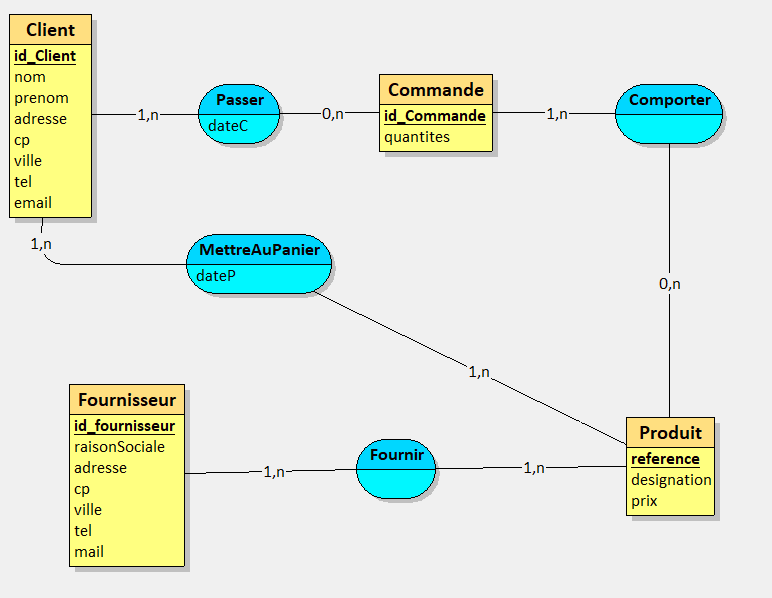
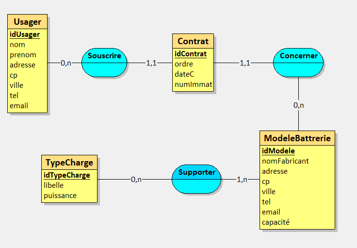

# 1 – Analyse MCD existant

## 1. Etablir et rédiger les règles de gestion correspondant au domaine étudié du SI.

Les clients sont identifiés par un numéro unique, possèdent un nom, un prénom, une adresse (adresse, cp, ville) et des coordonnées de contact (tel, email).

Ils peuvent passer des commandes qui sont identifiées par un numéro unique, une date de création, une adresse de livraison et un code d'état.

La livraison de ces commandes peut se faire selon avec ou sans types de livraison.

La livraison sans type est identifiée par un numéro unique et une date de livraison.

La livraison avec type est identifiée par un numéro unique, un libellé, des frais de port et le délai de livraison.

Les commandes peuvent être détaillées selon une certaine quantité et concernent des articles qui sont identifiés par une référence (numéro unique), une désignation, un prix, une tranche d'âge et sa disponibilité.

La livraison peut se faire par lot selon une certaine quantité.

## 2. Rescencer les associations et préciser leur type (CIF, CIM).

Il y a 5 associations:
- Passer de type CIF (Contrainte d'Intégrité Fonctionnelle) car une des branches a un max en 1.
- LivrerEnMode: de type CIF car une des branches a un max en 1.
- Livrer de type CIF car une des branches a un max en 1.
- LivrerLot de type CIM (Contrainte d'Intégrité Multiple) car elle possède une propriété.
- Detailler de type CIM car elle possède une propriété.

## 3. Réaliser le modèle logique des données relationnel (MLDR).

Client(id_client, nom, prenom, adresse, cp, ville, tel, email)
clé primaire: id_Client

Commande(id_Commande, dateC, adresseLivraison, codeEtat, id_Client, id_TypeLivraison)
clé primaire: id_Commande
clés étrangères: id_Client en référence à id_client de Client
id_TypeLivraison en référence à type de livraison Textuelle "courte":
Commande(id_Commande, dateC, adresseLivraison, codeEtat, #id_Client, #id_TypeLivraison)

Passer(id_commande, id_Client)
Clé primaire: id_Commande, id_client
Clés étrangères: id_Commande en référence à id_Commande de Commande
id_Client en référence à id_Client de Client
Textuelle "courte":
Passer(#id_Commande, #id_Client)

LivrerEnMode(#id_TypeLivraison, #id_Commande)
Clés étrangères: id_TypeLivraison, id_Commande

TypeLivraison(id_TypeLivraison, libelle, fraisPort, delaiPort)
Clé primaire: TypeLivraison

Article(reference, designation, prix, trancheAge, dispo)
Clé primaire: reference

Livraison(id_Livraison, dateLivraison, #reference)
Clé primaire: id_Livraison
Clé étrangère: reference

LivrerLot(#id_livraison, #reference, quantiteLivree)

Detailler(#reference, #id_Commande, quantite)

Livrer(#id_livraison, #id_Commande)

# 2 – Corrections sur MCD

Commande est passée par un et un seul client donc la cardinalité est (1,1)
S'il y a une commande il y a au moins un produit dans la commande donc entre Commande et Comporter il y a une cardinalité de (1,n).
Un produit peut faire l'objet d'une commande ou pas (il est juste en stock) donc entre comporter et produit la cardinalité est de (0,n).
Un produit peut être fourni par un fournisseurs donc la cardinalité entre produit et Fournir est (1,1).

# 3 – MCD Faux

## 1. Relevez les erreurs sur le MCD
Le `numImmat` est une propriété qui ne peut être dans ce type d'association.

`Souscrire` est une CIF car il y a un 1 en max dans une des branches et donc l'association ne peut être ternaire mais doit être binaire.

`contactFabricant` et `adresseFabricant` sont trop vagues.

## 2. Apportez les éventuelles corrections, en les justifiant

- Suppression de l'entité `DateContrat`  pour que `Souscrire` soit binaire et je place `dateC` en attribut de `Contrat`.
- Déplacement de  `numImmat` dans `Contrat` pour que `Concerner` soit vraiment une CIF.

- Précision sur `contactfabricant` et `adresseFabriquant`
    - `tel` et `email` pour `contactFabricant`
    - `adresse` `cp` et `ville` pour `adresseFabricant`

