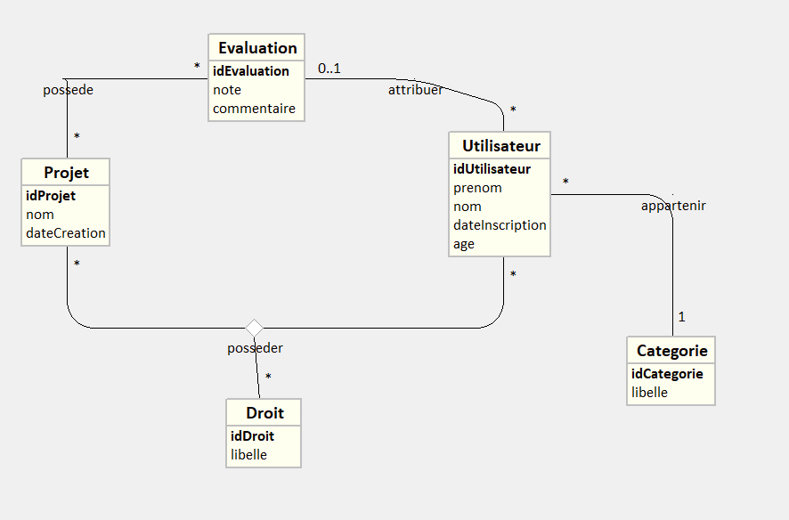
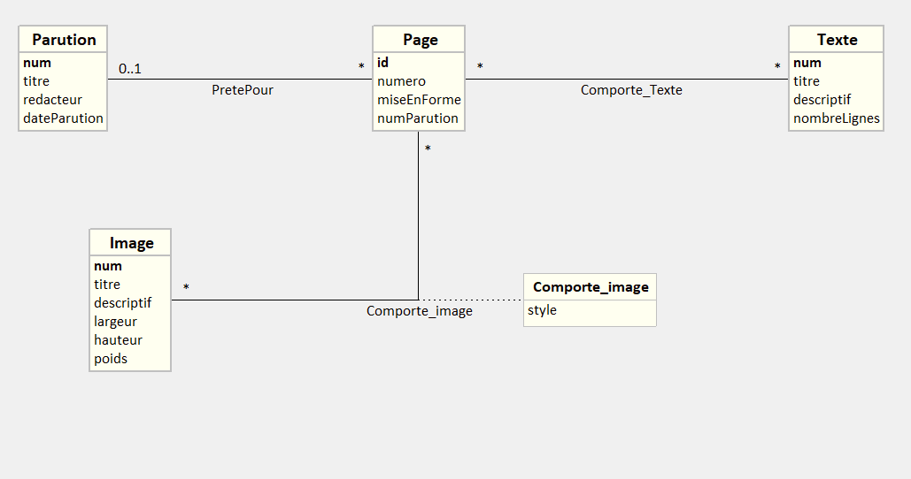

# 1 – Analyse MCD existant

## 1. Etablir et rédiger les règles de gestion correspondant au domaine étudié du SI.

Les employés sont identifiés par un numéro unique, possèdent un nom, un prénom, une date d'entrée et un âge.

Ils son affectés à un service. Chaque service est identifié par un numéro unique et possèdent un nom.

Chaque service peut disposer si besoin de véhicule(s) durant des périodes.
Chaque période est indentifiée par un numéro unique, et possède une date de début et une date de fin.
Chaque véhicule est identifié par un numéro unique d'immatriculation et possède une date d'entrée dans le parc automobile.

Un véhicule est d'un type de modèle particulier. Chaque modèle est identifié par un numéro unique, et possède un nom court et un nom long.

Chaque modèle est produit par une marque. Chaque marque est identifiée par un numéro unique et possède un nom de marque.

Chaque employé peut utiliser un ou plusieurs véhicules.

## 2. Rescencer les associations et préciser leur type (CIF, CIM).

Il y a 5 associations:
- affecter
- disposerDe
- estDuType
- ProduitPar
- utiliser

affecter: CIF (Contrainte d'Intégrité Fonctionnelle) car il y a une branche avec un max de 1. De plus elle est binaire et elle ne possède pas de propriété.

disposerDe: CMI (Contrainte d'intégrité multiple) car elle n'a pas de 1 en max sur l'une de ses branche, et elle est ternaire.

estDutype: CIF car une de ses branches a un max en 1. De plus elle est binaire et ne possède pas de propriété.

ProduitPar: CIF car une des ses branches a un max en 1. De plus elle est binaire et ne possède pas de propriété.

utiliser: CIF car une de ses branches a un max en 1. De plus elle est binaire et ne possède pas de propriété.

## 3. Réaliser le modèle logique des données relationnel (MLDR).

**Employe**(<ins>id</ins>, nom, prenom, dateEntree, age, #idService)  
Clé primaire: id  
Clé(s) étrangère(s): idService en référence à id de Service  

**Service**(<ins>id</ins>, nom)
Clé primaire: id  

**Periode**(<ins>id_Periode</ins>, dateDebut, dateFin, #idService, #immat)  
Clé primaire: id_periode  
Clé(s) étrangère(s):
- idService en référence à id de Service
- immat en référence à immat de Vehicule

  

**Vehicule**(<ins>immat</ins>, dateEntreeParc, #idEmploye, #idModele)  
Clé primaire: immat  
Clé(s) secondaire(s):
- idEmploye en référence à id d'Employe
- idModele en référence à id de Modele 

**Modele**(<ins>id</ins>, nomCourt, nomLong, #idMarque)  
Clé primaire: id  
Clé(s) secondaire(s): idMarque en référence à id de Marque  

**Marque**(<ins>id</ins>, nomMarque)  
Clé primaire: id  

**disposerDe**(#idService, #immat, #id_Periode)  
Clé primaire: idService, immat, id_Periode  
Clé(s) étrangère(s):
- idService en référence à id de Service
- immat en référence à immat de Vehicule
- id_Periode en référence à id_Periode de Periode

# 2 – Ajout de règles de gestion

Une entité Evaluation a été ajouté.  
Diagramme de classe intégrant les règles de gestion:

  

# 3 – Rétro-conception 

Diagramme de classe: 

