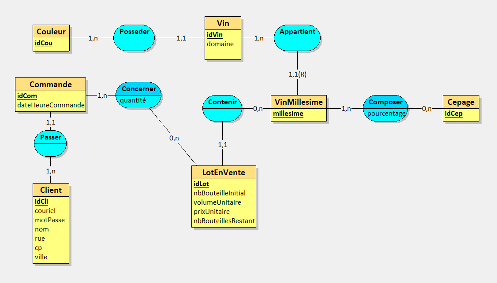
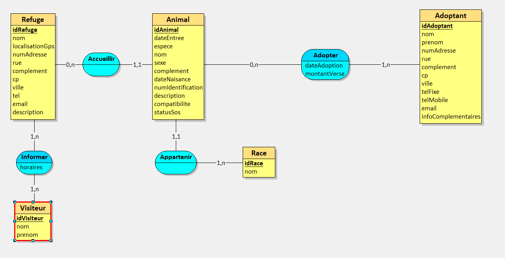

# 1 – Rétroconception viticole

## 1. Expliquez pour quelle raison la clé du millésime est composite (idVin,millesime)

Identifier un vin de façon unique n'est possible que si l'on prend en compte les 2 attributs que sont le millésime et l'identifiant du vin. Ils sont liés de manière relative. 

## 2. Elaborez le MEA en utilisant Looping


# 2 – Refuges SPA – conception de A à Z

## 1. Après analyse de ce système d’information, proposer un modèle conceptuel des données en utilisant le formalisme de votre choix.

 



## 2. Elaborer le modèle logique des données relationnel, en version textuelle normalisée

**Refuge** = (<ins>idRefuge</ins>, nom, localisationGps, numAdresse, rue , complement, cp, ville, tel, email, description)  

**Adoptant** = (<ins>idAdoptant</ins>, nom, prenom, numAdresse, rue, complement, cp, ville, telFixe, telMobile, email, infoComplementaires)  

**Race** = (<ins>idRace</ins>, nom)  

**Visiteur** = (<ins>idVisiteur</ins>, nom, prenom)  

**Animal** = (<ins>idAnimal</ins>, dateEntree, espece, nom, sexe, complement, dateNaisance, numIdentification, description, compatibilite, statusSos, #idRace, #idRefuge)  

**Adopter** = (<ins>#idAnimal</ins>, <ins>#idAdoptant</ins>, dateAdoption, montantVerse)  

**Informer** = (<ins>#idRefuge</ins>, <ins>#idVisiteur</ins>, horaires)  


## 3. Générer la base de données pour MariaDB et afficher le modèle physique

```sql
CREATE TABLE Refuge(
   idRefuge CHAR(50),
   nom VARCHAR(50) NOT NULL,
   localisationGps VARCHAR(50) NOT NULL,
   numAdresse VARCHAR(50),
   rue VARCHAR(50) NOT NULL,
   complement VARCHAR(50) NOT NULL,
   cp VARCHAR(50) NOT NULL,
   ville VARCHAR(50) NOT NULL,
   tel VARCHAR(50) NOT NULL,
   email VARCHAR(50),
   description VARCHAR(300),
   PRIMARY KEY(idRefuge)
);

CREATE TABLE Adoptant(
   idAdoptant VARCHAR(50),
   nom VARCHAR(50) NOT NULL,
   prenom VARCHAR(50) NOT NULL,
   numAdresse VARCHAR(50),
   rue VARCHAR(50) NOT NULL,
   complement VARCHAR(50) NOT NULL,
   cp VARCHAR(50) NOT NULL,
   ville VARCHAR(50) NOT NULL,
   telFixe VARCHAR(50),
   telMobile VARCHAR(50) NOT NULL,
   email VARCHAR(50) NOT NULL,
   infoComplementaires VARCHAR(100),
   PRIMARY KEY(idAdoptant)
);

CREATE TABLE Race(
   idRace CHAR(50),
   nom VARCHAR(50) NOT NULL,
   PRIMARY KEY(idRace)
);

CREATE TABLE Visiteur(
   idVisiteur CHAR(50),
   PRIMARY KEY(idVisiteur)
);

CREATE TABLE Animal(
   idAnimal CHAR(50),
   dateEntree DATE NOT NULL,
   espece VARCHAR(50) NOT NULL,
   nom VARCHAR(50) NOT NULL,
   sexe VARCHAR(50) NOT NULL,
   complement VARCHAR(50) NOT NULL,
   dateNaisance DATE NOT NULL,
   numIdentification VARCHAR(50) NOT NULL,
   description VARCHAR(50) NOT NULL,
   compatibilite VARCHAR(50) NOT NULL,
   statusSos VARCHAR(50),
   idRace CHAR(50) NOT NULL,
   idRefuge CHAR(50) NOT NULL,
   PRIMARY KEY(idAnimal),
   FOREIGN KEY(idRace) REFERENCES Race(idRace),
   FOREIGN KEY(idRefuge) REFERENCES Refuge(idRefuge)
);

CREATE TABLE Adopter(
   idAnimal CHAR(50),
   idAdoptant VARCHAR(50),
   dateAdoption DATE NOT NULL,
   montantVerse VARCHAR(50),
   PRIMARY KEY(idAnimal, idAdoptant),
   FOREIGN KEY(idAnimal) REFERENCES Animal(idAnimal),
   FOREIGN KEY(idAdoptant) REFERENCES Adoptant(idAdoptant)
);

CREATE TABLE Informer(
   idRefuge CHAR(50),
   idVisiteur CHAR(50),
   horaires VARCHAR(50),
   PRIMARY KEY(idRefuge, idVisiteur),
   FOREIGN KEY(idRefuge) REFERENCES Refuge(idRefuge),
   FOREIGN KEY(idVisiteur) REFERENCES Visiteur(idVisiteur)
);


```

# 3 – Gestion de projet Scrum

## 1. Après analyse de ce système d’information, proposer un modèle conceptuel des données en utilisant le formalisme de votre choix


## 2. Elaborer le modèle logique des données relationnel, en version crow’s foot.

