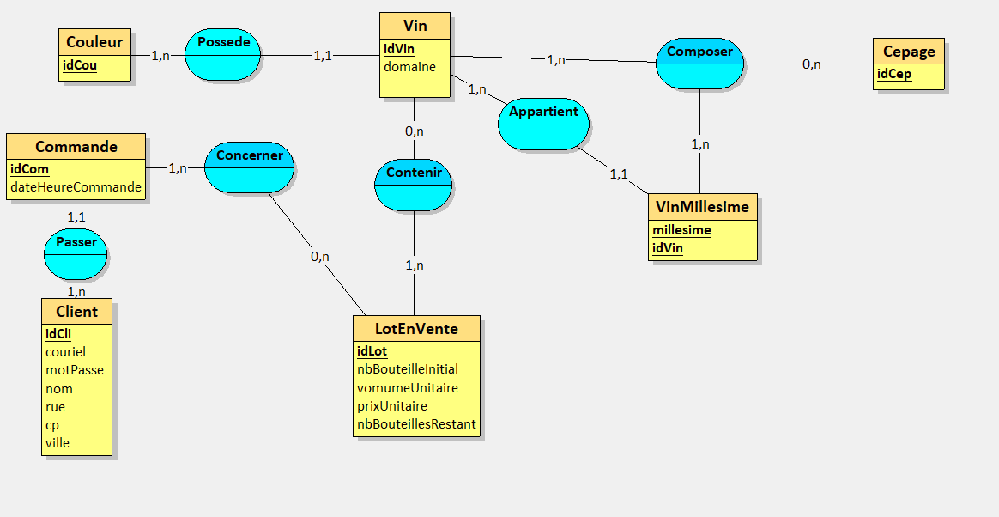
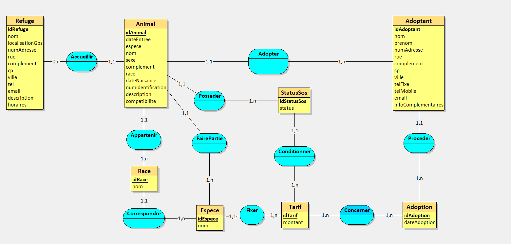
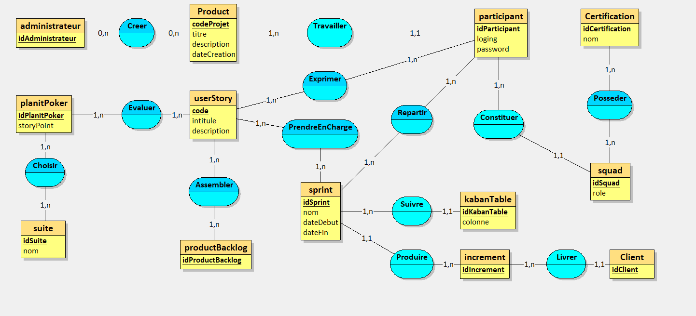
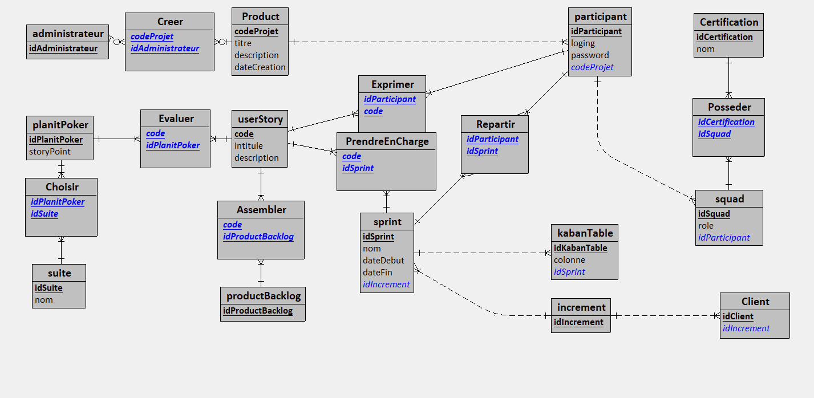

# 1 – Rétroconception viticole

## 1. Expliquez pour quelle raison la clé du millésime est composite (idVin,millesime)

Il s'agit de préciser la nature unique d'un vin selon son millesime.

## 2. Elaborez le MEA en utilisant Looping


# 2 – Refuges SPA – conception de A à Z

## 1. Après analyse de ce système d’information, proposer un modèle conceptuel des données en utilisant le formalisme de votre choix.

`status` correspond à SOS (boléen)  



## 2. Elaborer le modèle logique des données relationnel, en version textuelle normalisée

**Refuge** = (<ins>idRefuge</ins>, nom, localisationGps, numAdresse, rue, complement, cp, ville, tel, email, description, horaires)  

**Tarif** = (<ins>idTarif</ins>, montant)  

**Adoption** = (<ins>idAdoption</ins>, dateAdoption)  

**StatusSos** = (<ins>idStatusSos</ins>, status, #idTarif)  

**Adoptant** = (<ins>idAdoptant</ins>, nom, prenom, numAdresse, rue, complement, cp, ville, telFixe, telMobile, email, infoComplementaires, #idAdoption)  

**Espece** = (<ins>idEspece</ins>, nom, #idTarif)  

**Race** = (<ins>idRace</ins>, nom, #idEspece)  

**Animal** = (<ins>idAnimal</ins>, dateEntree, espece, nom, sexe, complement, race, dateNaisance, numIdentification, description, compatibilite, #idEspece, #idStatusSos, #idRace, #idAdoptant, #idRefuge)  

**Concerner** = (#idTarif, #idAdoption)


## 3. Générer la base de données pour MariaDB et afficher le modèle physique

```sql
CREATE TABLE Refuge(
   idRefuge CHAR(50),
   nom VARCHAR(50) NOT NULL,
   localisationGps VARCHAR(50) NOT NULL,
   numAdresse VARCHAR(50),
   rue VARCHAR(50) NOT NULL,
   complement VARCHAR(50) NOT NULL,
   cp VARCHAR(50) NOT NULL,
   ville VARCHAR(50) NOT NULL,
   tel VARCHAR(50) NOT NULL,
   email VARCHAR(50),
   description VARCHAR(300),
   horaires VARCHAR(50),
   PRIMARY KEY(idRefuge)
);

CREATE TABLE Tarif(
   idTarif CHAR(50),
   montant INT NOT NULL,
   PRIMARY KEY(idTarif)
);

CREATE TABLE Adoption(
   idAdoption CHAR(50),
   dateAdoption DATE NOT NULL,
   PRIMARY KEY(idAdoption)
);

CREATE TABLE StatusSos(
   idStatusSos CHAR(50),
   status LOGICAL NOT NULL,
   idTarif CHAR(50) NOT NULL,
   PRIMARY KEY(idStatusSos),
   FOREIGN KEY(idTarif) REFERENCES Tarif(idTarif)
);

CREATE TABLE Adoptant(
   idAdoptant VARCHAR(50),
   nom VARCHAR(50) NOT NULL,
   prenom VARCHAR(50) NOT NULL,
   numAdresse VARCHAR(50),
   rue VARCHAR(50) NOT NULL,
   complement VARCHAR(50) NOT NULL,
   cp VARCHAR(50) NOT NULL,
   ville VARCHAR(50) NOT NULL,
   telFixe VARCHAR(50),
   telMobile VARCHAR(50) NOT NULL,
   email VARCHAR(50) NOT NULL,
   infoComplementaires VARCHAR(100),
   idAdoption CHAR(50) NOT NULL,
   PRIMARY KEY(idAdoptant),
   FOREIGN KEY(idAdoption) REFERENCES Adoption(idAdoption)
);

CREATE TABLE Espece(
   idEspece CHAR(50),
   nom VARCHAR(50) NOT NULL,
   idTarif CHAR(50) NOT NULL,
   PRIMARY KEY(idEspece),
   FOREIGN KEY(idTarif) REFERENCES Tarif(idTarif)
);

CREATE TABLE Race(
   idRace CHAR(50),
   nom VARCHAR(50) NOT NULL,
   idEspece CHAR(50) NOT NULL,
   PRIMARY KEY(idRace),
   FOREIGN KEY(idEspece) REFERENCES Espece(idEspece)
);

CREATE TABLE Animal(
   idAnimal CHAR(50),
   dateEntree DATE NOT NULL,
   espece VARCHAR(50) NOT NULL,
   nom VARCHAR(50) NOT NULL,
   sexe VARCHAR(50) NOT NULL,
   complement VARCHAR(50) NOT NULL,
   race VARCHAR(50) NOT NULL,
   dateNaisance DATE NOT NULL,
   numIdentification VARCHAR(50) NOT NULL,
   description VARCHAR(50) NOT NULL,
   compatibilite VARCHAR(50) NOT NULL,
   idEspece CHAR(50) NOT NULL,
   idStatusSos CHAR(50) NOT NULL,
   idRace CHAR(50) NOT NULL,
   idAdoptant VARCHAR(50) NOT NULL,
   idRefuge CHAR(50) NOT NULL,
   PRIMARY KEY(idAnimal),
   FOREIGN KEY(idEspece) REFERENCES Espece(idEspece),
   FOREIGN KEY(idStatusSos) REFERENCES StatusSos(idStatusSos),
   FOREIGN KEY(idRace) REFERENCES Race(idRace),
   FOREIGN KEY(idAdoptant) REFERENCES Adoptant(idAdoptant),
   FOREIGN KEY(idRefuge) REFERENCES Refuge(idRefuge)
);

CREATE TABLE Concerner(
   idTarif CHAR(50),
   idAdoption CHAR(50),
   PRIMARY KEY(idTarif, idAdoption),
   FOREIGN KEY(idTarif) REFERENCES Tarif(idTarif),
   FOREIGN KEY(idAdoption) REFERENCES Adoption(idAdoption)
);


```

# 3 – Gestion de projet Scrum

## 1. Après analyse de ce système d’information, proposer un modèle conceptuel des données en utilisant le formalisme de votre choix



## 2. Elaborer le modèle logique des données relationnel, en version crow’s foot.

