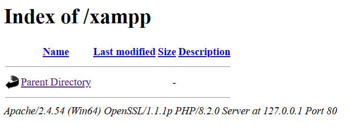

## 9 - Configuration de serveur HTTP
[Menu](menu.md)


1. Modifiez la configuration de votre virtualhost local (avec apache) pour qu’il pointe sur le dossier docs de votre repository.

Modification du fichier `httpd-vhost.conf`
```shell
<VirtualHost *:80>
    DocumentRoot "C:/xampp/htdocs/"
    ServerName 127.0.0.1
</VirtualHost>

<VirtualHost *:80>
    DocumentRoot "C:/Users/Didier/Documents/Git/nfa085/nfa085/docs"
    ServerName dev.local
    ErrorLog "logs/dev.local-error.log"
    CustomLog "logs/dev.local-access.log" common
    <Directory "C:/Users/Didier/Documents/Git/nfa085/nfa085/docs">
        Require all granted   
    </Directory>
</VirtualHost>
```


2. Modifiez la configuration du serveur pour qu’il n’affiche pas les informations relatives à sa version, ni celles relatives au système d’exploitation.  
Modification du fichier `httpd.conf`

```shell
# Disable Apache and OS signatures
ServerTokens Prod
ServerSignature off 
```
3. Désactivez le listage des répertoires

Modification du fichier `httpd.conf`  
On passe de
```shell
 Options Indexes FollowSymLinks Includes ExecCGI
```  
à
```shell
#Disable directory browsing
    Options FollowSymLinks Includes ExecCGI
```
4. Affichez les modifications effectuées

Les modifications se font dans le fichier httpd.conf de façon générale et httpd-vhost.conf pour une vhost en particulier.


5. Comparez les résultats avant/après

- Informations de versions d'Apache et d'OS:

Avant


Après


- Directory browsing

Aucun changements sur le répertoire docs.
Le répertoire htdocs par contre est affecté car lorsque l'on précise dans la barre d'adresse
du navigateur 127.0.0.1/xampp par exemple:

Avant s'affichait l'arborescence des fichiers et répertoires.



Après

   

[[haut de page]](#9---configuration-de-serveur-http)


