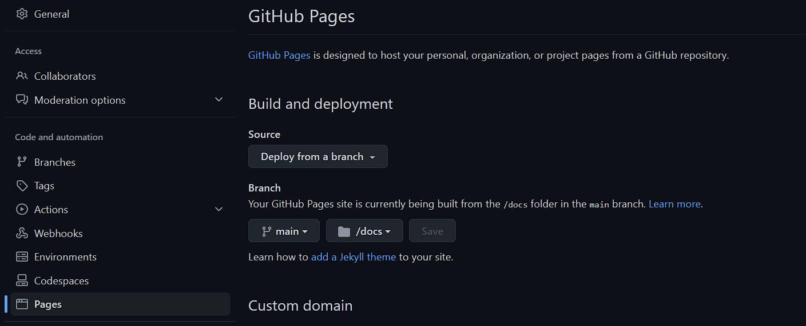

## 8 - Pages Web
[Menu](menu.md)

Github et les github pages vont nous servir d’hébergement pour les travaux web effectués.
• Activer les github pages sur votre repository en allant dans settings/pages.
• Publier sur la branche main, dans le dossier docs



Créer le dossier docs en local à la racine de votre repository:    
Ajouter la page index.html    
• Faisant référence à la feuille de style main.css   
`<link rel="stylesheet" type="text/css" href="./assets/css/main.css">`  
• Affichant le nom du module « nfa085 » en titre de niveau 1   
`<h1>nfa085</h1>`  
• « Documents » en titre de niveau 2  
`<h2>Documents</h2>`  
• Lister et mettre en lien les documents md produits dans les séances.  
`<a href="https://github.com/scarabe22/nfa085/blob/main/Documents/seance2/client_serveur_web.md">Client Seveur Web [Séance2]</a>`  

• main.css doit définir une Google font (de votre choix) sur le body  
index.html:
```html
<link rel="preconnect" href="https://fonts.googleapis.com">
  <link rel="preconnect" href="https://fonts.gstatic.com" crossorigin>
  <link href="https://fonts.googleapis.com/css2?family=Roboto:wght@300&display=swap" rel="stylesheet">
```  
main.css:
```css
body {
    font-family: 'Roboto', sans-serif;
}
```
• Définir une présentation spécifique sur les titres.
```css
h1 {
    font-size: 300%;
    text-align: center;

}

h2 {
    font-size: 200%;
    text-align: center;
}

```
Les fichiers .gitkeep sont de simples documents textes vides permettant de forcer la création du dossier dans git.

A chaque commit/push avec modification du contenu du dossier docs, github exécute une action de déploiement (voir github actions)  

[[haut de page]](#8---pages-web)

