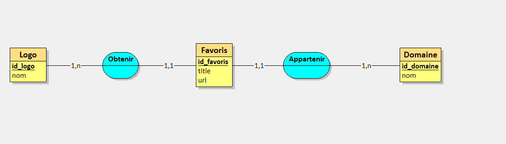

1. Représenter le modèle de données en utilisant la notation conceptuelle de votre choix 
(UML ou Merise).




2. Proposer une organisation des données pour les stocker en JSON dans le localStorage
(en précisant des exemples JSON).
```javascript
{
  "domains": [
    {
      "id": 1,
      "name": "Home",
      "description": "Default domain",
      "favorites": [
        {
          "id": 1,
          "title": "Google",
          "url": "https://www.google.com",
          "domainId": 1,
          "logo": "https://www.google.com/images/branding/googlelogo/2x/googlelogo_color_272x92dp.png"
        },
        {
          "id": 2,
          "title": "Facebook",
          "url": "https://www.facebook.com",
          "domainId": 1,
          "logo": "https://www.facebook.com/images/fb_icon_325x325.png"
        }
      ]
    },
    {
      "id": 2,
      "name": "Work",
      "description": "Work domain",
      "favorites": [
        {
          "id": 3,
          "title": "GitHub",
          "url": "https://github.com",
          "domainId": 2,
          "logo": "https://github.githubassets.com/images/modules/logos_page/GitHub-Mark.png"
        }
      ]
    }
  ]
}
```

Les données sont organisées sous forme d'un objet JSON avec deux propriétés principales : "domains" et "favorites".
La propriété "domains" contient un tableau d'objets représentant les différents domaines de favoris. Chaque objet possède un identifiant unique (id), un nom (name), une description (description) et un tableau de favoris (favorites).
La propriété "favorites" contient un tableau d'objets représentant les différents favoris. Chaque objet possède un identifiant unique (id), un titre (title), une URL (url), un identifiant de domaine (domainId) et un logo (logo).
Dans cet exemple, il y a deux domaines : Home et Work. Le domaine Home contient deux favoris (Google et Facebook), tandis que le domaine Work ne contient qu'un seul favori (GitHub).
Le logo de chaque favori est obtenu à chaque requête en interrogeant une API, donc il est stocké dans le localStorage pour éviter de devoir le récupérer à chaque fois.